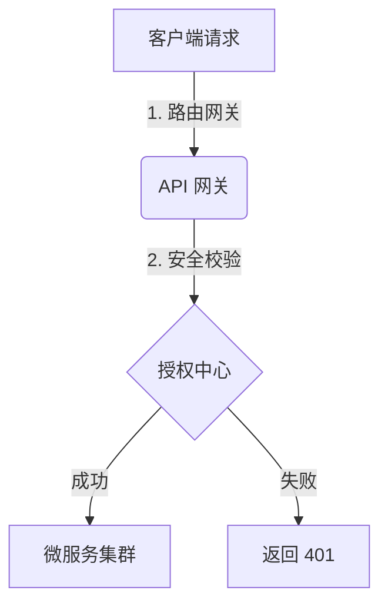

# 博客文章写作指南与模板 (Article Template & Guide)

为了让您能够顺利更新博客，本指南详细说明了文章的**命名规范**、**元数据 (Frontmatter) 格式**以及**支持的 Markdown 高级排版特性**。

---

## 1. 文件命名规范

文章应存放在项目的 `posts/` 目录下。为了支持双语切换，文件命名遵循以下规则：
*   **中文版文章**：`[文章唯一ID].zh.md`（例如：`my-new-tech-post.zh.md`）
*   **英文版文章**：`[文章唯一ID].en.md`（例如：`my-new-tech-post.en.md`）

> [!IMPORTANT]
> 中英文版本的**文件前缀必须完全一致**（即 `id` 一致），系统构建脚本会自动将它们归类为同一篇文章的两种语言版本。

---

## 2. 写作模板

您可以直接复制下方内容新建您的文章文件：

```markdown
---
id: "my-new-tech-post"
lang: "zh"
date: "2026.06.05"
stardate: "BUILD-1.3.0"
author: "Ricardo"
readTime: "5.0 min"
wordCount: 1500
category: "System"
title: "在这里输入文章的中文标题"
summary: "在这里输入文章的简短摘要，展示在列表页中。"
tags: ["架构", "性能优化", "示例"]
---

### 0x01 引言

在这里编写您的段落内容。支持常见的 Markdown 语法，如**粗体文字**，*斜体文字*，以及 `单行代码块`。

---

### 0x02 架构设计与流程图 (Mermaid)

本博客集成了 Mermaid.js 图表渲染引擎。您可以直接使用 ```mermaid 编写拓扑图，它们会在页面加载时被自动渲染为高保真的矢量图（SVG）：



---

### 0x03 GitHub 风格警告框 (Alert Callouts)

本博客支持 5 种不同严重程度的警告提示框，书写时需以 `>` 开头紧跟对应的标识符：

> [!NOTE]
> 💡 **说明提示**：用于展示一般的背景背景、说明或辅助信息。

> [!TIP]
> ✨ **使用技巧**：用于提供最佳实践、优化建议或效率技巧。

> [!IMPORTANT]
> 📌 **重要提示**：用于强调关键性的要求、步骤或必须知晓的内容。

> [!WARNING]
> ⚠️ **警告提示**：用于防范潜在的问题、接口重试引发的幂等性开销等。

> [!CAUTION]
> 🛑 **特别警告**：用于高风险操作提示，例如数据丢失、内存泄漏等严重隐患。

---

### 0x04 基础元素排版示例

#### 1. 自动高亮的代码块 (Code Blocks)
代码块支持 Mac 风格的红黄绿三色控制按钮、语言自动识别和一键 COPY 复制功能：

```java
@RestController
public class DemoController {
    @GetMapping("/hello")
    public String sayHello() {
        return "Hello World";
    }
}
```

#### 2. 标准数据表格 (Tables)
表格支持自动边框和美化排列：

| 指标维度 | 优化前 (Before) | 优化后 (After) | 提升幅度 |
| :--- | :--- | :--- | :--- |
| 首字节响应 (TTFB) | 3400ms | 180ms | 94.7% |
| 并发会话数 | 1000 | 10000+ | 10x |

#### 3. 列表元素 (Lists)
*   无序列表项一
*   无序列表项二
    *   嵌套项需注意空格缩进

1.  有序列表项一
2.  有序列表项二

#### 4. 图片排版 (Images)
插入图片使用标准 Markdown 语法。系统会自动为图片添加响应式宽度自适应、居中对齐、黑实线框和复古硬核投影：


> [!TIP]
> **本地图片资源存放规范**：
> 请将所有静态图片资源放入项目的 `/public/` 目录下（例如放在 `/public/posts-media/flow.png`），在 Markdown 中引用时，请使用根目录绝对路径，去掉 `/public` 前缀即可（例如：`/posts-media/flow.png`）。同时也支持引用网络图片 URL。

---

### 0x05 结语

写完后，运行 `npm run dev` 即可在本地实时预览文章渲染效果。
```

---

## 3. Frontmatter 字段详解

| 字段名 | 类型 | 说明 | 示例 |
| :--- | :--- | :--- | :--- |
| `id` | String | **必填**。文章的唯一英文标识符，中英文版本必须相同。 | `"my-new-tech-post"` |
| `lang` | String | 语言标识。中文用 `"zh"`，英文用 `"en"`。 | `"zh"` |
| `date` | String | 写作日期，格式为 `YYYY.MM.DD`，决定归档排序。 | `"2026.06.05"` |
| `stardate` | String | 版本或星历日期标识，会展示在详情页。 | `"BUILD-1.3.0"` |
| `author` | String | 作者，项目规范统一使用 `"Ricardo"`。 | `"Ricardo"` |
| `readTime` | String | 预估阅读时间。 | `"5.0 min"` |
| `wordCount` | Number | 文章字数。 | `1500` |
| `category` | String | 分类，决定列表页筛选（如 `"System"`, `"Frontend"`, `"Database"`）。 | `"System"` |
| `title` | String | 文章标题。 | `"高并发系统优化"` |
| `summary` | String | 文章摘要。 | `"探讨如何通过缓存和队列优化高并发系统的响应速度。"` |
| `tags` | Array | 标签列表。最多建议 3-4 个。 | `["缓存", "高并发"]` |

---

## 4. 发布流程

1.  将写好的 `.md` 文件放入 `posts/` 目录。
2.  在控制台运行本地构建并启动预览服务：
    ```bash
    npm run dev
    ```
    *构建脚本 `scripts/build-posts.cjs` 会自动扫描新文章，将其编译并暴露在文章目录中。*
3.  检查本地运行状态无误后，提交并推送代码至您的 GitHub 仓库。Cloudflare Pages 会自动触发构建和线上部署。
