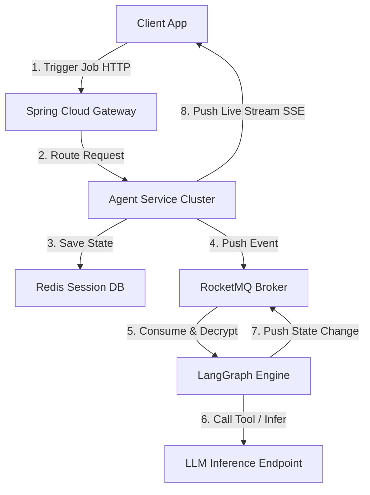

### 0x01 Microservice & LLM Integration Pain Points

Integrating Large Language Model (LLM) driven **AI Agents** into traditional enterprise microservice architectures exposes a fundamental paradigm conflict:
1. **Prolonged Execution & Latency**: LLM token generation is computationally heavy and network-bound, taking seconds or minutes to complete. This quickly exhausts synchronous worker threads (e.g. Tomcat HTTP thread pools) in microservices.
2. **Dynamic State & Orchestration**: Multi-Agent execution flows are non-deterministic, requiring state persistence across nodes, logic branches, and human-in-the-loop validation checkpoints.

To bridge this gap, we designed a non-blocking asynchronous orchestrator bus integrating **Spring Cloud Alibaba** with **LangGraph**.

---

### 0x02 Architectural Topology & State Alignment

We engineered the execution pipeline around an **asynchronous event-driven** model, isolating the long-running LLM inference loop from the client-facing gateway thread.



#### 1. Streaming Outputs via Server-Sent Events (SSE)
On the API layer, we leveraged **Server-Sent Events (SSE)** to stream generated tokens to the client browser in real time. This keeps connections open dynamically and prevents browser HTTP timeout errors:

```java
@RestController
@RequestMapping("/api/agent")
public class AgentController {

    @Autowired
    private AgentOrchestrator orchestrator;

    @GetMapping(value = "/stream", produces = MediaType.TEXT_EVENT_STREAM_VALUE)
    public Flux<ServerSentEvent<String>> streamAgentResponse(@RequestParam String sessionId, @RequestParam String prompt) {
        return orchestrator.execute(sessionId, prompt)
            .map(token -> ServerSentEvent.<String>builder()
                .id(sessionId)
                .event("message")
                .data(token)
                .build())
            .doOnError(e -> log.error("Agent execution failed for session: {}", sessionId, e));
    }
}
```

---

### 0x03 Resilience & Dedicated Resource Isolation

In multi-agent systems, agents make frequent tool calls (Tool Calling) to query internal microservices (like verifying order statuses or checking inventory levels). This creates a high risk of cascade failures if downstream systems stall.

#### 1. Sentinel Fault Tolerance & Circuit Breaking
We implemented **Alibaba Sentinel** to govern our LLM endpoints. If model response latencies breach predefined SLAs, the circuit breaker triggers, routing calls to a localized caching fallback service.

```yaml
# Sentinel Rule Configuration
spring.cloud.sentinel.transport.dashboard=localhost:8080
spring.cloud.sentinel.datasource.flow.nacos.data-id=agent-flow-rules
```

#### 2. Thread Pool Separation
To prevent agent state evaluations from saturating critical inter-service RPC (Dubbo) worker pools, we isolated LangGraph orchestrations using dedicated thread properties:

```java
@Configuration
public class ThreadPoolConfig {

    @Bean(name = "agentExecutor")
    public Executor agentExecutor() {
        ThreadPoolTaskExecutor executor = new ThreadPoolTaskExecutor();
        executor.setCorePoolSize(16);
        executor.setMaxPoolSize(32);
        executor.setQueueCapacity(200);
        executor.setThreadNamePrefix("AgentExecutor-");
        executor.setRejectedExecutionHandler(new ThreadPoolExecutor.CallerRunsPolicy());
        executor.initialize();
        return executor;
    }
}
```

> [!WARNING]
> Any state-modifying actions inside agent-triggered Tool Calls must enforce **idempotency**. Under heavy workloads, network retries by the LLM middleware could lead to duplicate API invocations.

---

### 0x04 Tuning Optimization Metrics

Through reactive stream piping and thread isolation, the updated integration architecture achieved outstanding results:
- **Tomcat Thread Saturation**: Decreased from `94%` down to a stable `12%`, resolving thread starvation crashes.
- **Concurrent Session Handling**: Leveraging Project Reactor, a single application instance easily supports `10,000+` active persistent SSE streams.
- **Time to First Token (TTFT)**: Dropped from `3400ms` (complete generation buffering) to `180ms` (first streamed character), vastly improving UX responsiveness.
