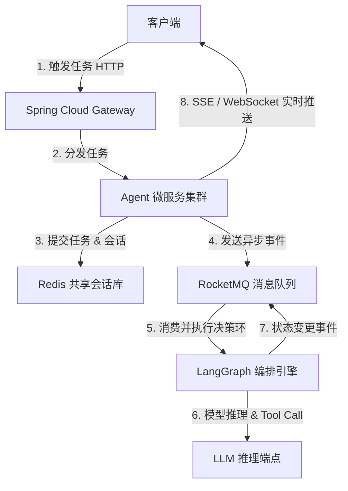

### 0x01 微服务与大模型的集成痛点

当我们将大语言模型（LLM）驱动的 **AI Agent（智能体）** 引入传统企业级微服务架构时，会遭遇严重的范式冲突：
1. **长耗时与高延迟**：大模型生成（Generation）过程伴随着极高的网络延时与推理耗时，通常在数秒甚至数分钟以上，极易撑爆微服务中默认基于同步阻塞的 HTTP 线程池（如 Tomcat）。
2. **状态流转与复杂编排**：多智能体（Multi-Agent）的执行流具有动态性与不确定性，需要维护会话状态、决策分支以及人机交互（Human-in-the-loop）的打断机制。

为解决上述挑战，我们基于 **Spring Cloud Alibaba** 与 **LangGraph** 架构设计了一套异步非阻塞的智能体网关与协调总线。

---

### 0x02 架构拓扑与状态协同设计

整个体系采用**异步事件驱动**的设计思想，将漫长且不确定的 Agent 推理过程从用户请求的主线程中剥离出来。



#### 1. 基于 SSE 的流式应答输出
在微服务前端，我们采用 **Server-Sent Events (SSE)** 实现大模型 Token 级别内容的即时流式回显，防止浏览器因长时间等待 HTTP 响应而触发连接超时：

```java
@RestController
@RequestMapping("/api/agent")
public class AgentController {

    @Autowired
    private AgentOrchestrator orchestrator;

    @GetMapping(value = "/stream", produces = MediaType.TEXT_EVENT_STREAM_VALUE)
    public Flux<ServerSentEvent<String>> streamAgentResponse(@RequestParam String sessionId, @RequestParam String prompt) {
        return orchestrator.execute(sessionId, prompt)
            .map(token -> ServerSentEvent.<String>builder()
                .id(sessionId)
                .event("message")
                .data(token)
                .build())
            .doOnError(e -> log.error("Agent execution failed for session: {}", sessionId, e));
    }
}
```

---

### 0x03 编排器防抖与线程隔离优化

在多 Agent 协同场景中，由于大模型需要进行频繁的 Tool Calling（工具调用）去拉取微服务中的其他数据（如订单查询、库存检验），会引发极大的链路雪崩风险。

#### 1. Sentinel 限流与熔断策略
我们使用 **Alibaba Sentinel** 对大模型的 API 接口进行动态熔断控制。当模型服务发生过载或连接数超过阈值时，自动退避为基于本地知识库的本地缓存回答（Fallback）。

```yaml
# Sentinel 动态规则配置
spring.cloud.sentinel.transport.dashboard=localhost:8080
spring.cloud.sentinel.datasource.flow.nacos.data-id=agent-flow-rules
```

#### 2. 自定义线程池进行核心资源隔离
为了防止智能体执行流挤占系统关键 RPC（Dubbo）调度线程，我们使用独立配置的异步线程池来执行 LangGraph 节点转换计算：

```java
@Configuration
public class ThreadPoolConfig {

    @Bean(name = "agentExecutor")
    public Executor agentExecutor() {
        ThreadPoolTaskExecutor executor = new ThreadPoolTaskExecutor();
        executor.setCorePoolSize(16);
        executor.setMaxPoolSize(32);
        executor.setQueueCapacity(200);
        executor.setThreadNamePrefix("AgentExecutor-");
        executor.setRejectedExecutionHandler(new ThreadPoolExecutor.CallerRunsPolicy());
        executor.initialize();
        return executor;
    }
}
```

> [!WARNING]
> 智能体决策流中若包含数据库写操作，必须保证在 Tool 调用段实现**幂等性（Idempotency）**设计。因为模型的重试机制（Retry Policy）在大流量网络波动下可能会引发重复的接口调用。

---

### 0x04 调优成果展示

经过系统性的流式通道改造和线程隔离，系统上线后的整体性能指标如下：
- **Tomcat 工作线程占用率**：从先前的 `94%` 骤降至稳定的 `12%`，彻底消除了连接挂死风险。
- **并发连接处理能力**：利用 Reactor 响应式编程模型，系统单机可同时挂载 `10,000+` 个长连接会话。
- **平均交互感知延迟（Time to First Token）**：由 `3400ms`（整段生成）缩短至 `180ms`（首字符输出），用户体验极大提升。
